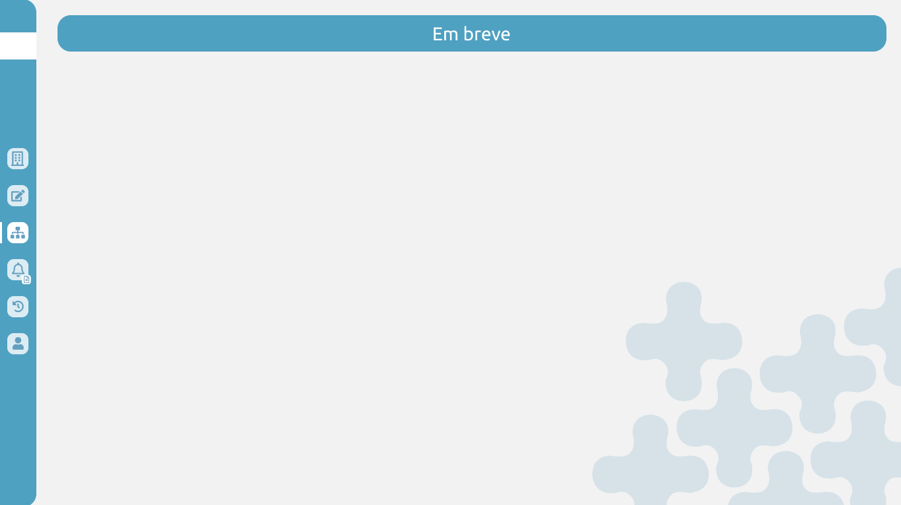

# BUG-008 — Tela "Funcionário(s)": background não segue o padrão do protótipo (fundo aparece branco)

## Tipo
UI / Layout

## Severidade
Baixa

## Ambiente
- SO: Windows 11
- Microsoft Edge: Versão 143.0.3650.96 (64 bits)
- Google Chrome: Versão 143.0.7499.170 (64 bits)

## Passos para reproduzir
1. Acessar a aba "Funcionário(s)".
2. Observar o background da tela.
3. Comparar com o padrão de background definido no protótipo.

## Resultado atual (Aplicação)
- O background da tela "Funcionário(s)" aparece totalmente branco, sem o padrão visual do protótipo.
- Não há redirecionamento funcional para a página "Em breve" (BUG-007), portanto o background dessa tela não pôde ser validado na aplicação.

## Resultado esperado (Protótipo)
- A tela "Funcionário(s)" deve manter o background padrão do protótipo, mesmo que parcialmente coberto pelo layout.

## Impacto
- Quebra a fidelidade visual com o protótipo, reduzindo consistência do layout.
- Pode afetar a percepção de qualidade e identidade visual da aplicação.
- Pode dificultar validação visual de outras telas/componentes que dependem do mesmo tema de background.

## Evidências
**Protótipo — referência do background padrão:**  

**Aplicação — tela "Funcionário(s)" com o background padrão:**  

## Dependência / Relacionado
- Relacionado ao **BUG-007** (redirecionamento para a tela "Em breve" indisponível para validação).

## Sugestão de correção
- Verificar camadas/estilos e aplicação do background (ex.: tema global, container principal e CSS).
