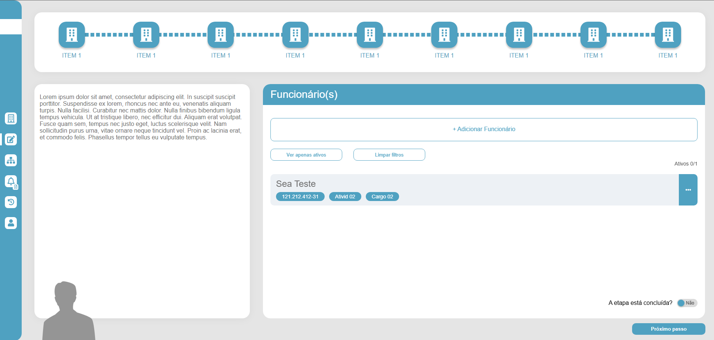

# BUG-001 — Fonte e cor não estão conforme protótipo (Segoe UI e #649FBF)

## Tipo
UI / Estilo

## Severidade
Média

## Ambiente
- SO: Windows 10/11
- Microsoft Edge: Versão 143.0.3650.96 (Compilação oficial) (64 bits)
- Google Chrome: Versão 143.0.7499.170 (Versão oficial) (64 bits)

## Passos para reproduzir
1. Abrir a aplicação.
2. Navegar pelas telas (ex.: "Funcionário(s)").
3. Comparar tipografia e cor principal com o protótipo do Figma.

## Resultado atual
- A fonte utilizada na aplicação não corresponde à fonte do protótipo.
- O tom de azul utilizado não corresponde ao do protótipo.

## Resultado esperado
- Fonte protótipo: **Segoe UI**.
- Cor principal conforme protótipo: **#649FBF**.

## Evidências
**Protótipo (Figma):**  

**Aplicação (Atual):**  

## Sugestão de correção
- Definir a fonte como Segoe UI e aplicar globalmente.
- Definir o tom de azul como #649FBF e aplicar globalmente.