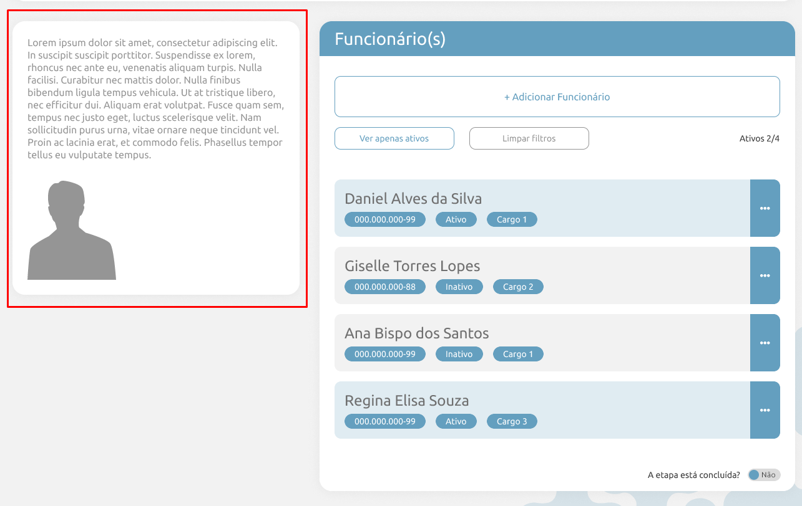
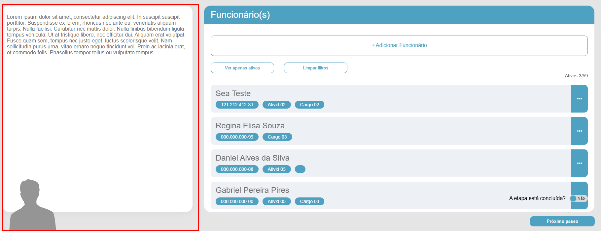

# BUG-005 — Card lateral esquerdo com dimensões/alinhamento diferentes do protótipo (tamanho do quadro e avatar)

## Tipo
UI / Conformidade com Protótipo 

## Severidade
Baixa 

## Ambiente
- SO: Windows 10/11
- Microsoft Edge: Versão 143.0.3650.96 (64 bits)
- Google Chrome: Versão 143.0.7499.170 (64 bits)

## Passos para reproduzir
1. Acessar a tela "Funcionário(s)".
2. Observar o card lateral esquerdo (área com texto "Lorem ipsum" e imagem de uma silhueta cinza).
3. Comparar o posicionamento e tamanho do card com o protótipo.

## Resultado atual (Aplicação)
- O card lateral esquerdo apresenta dimensões diferentes do protótipo, o quadro esta maior que o esperado.
- A imagem de silhueta (cinza) não está alinhada corretamente no canto inferior esquerdo do card.

## Resultado esperado (Protótipo)
- O card lateral esquerdo deve ter o mesmo tamanho do protótipo, um quadro menor.
- A silhueta (cinza) deve estar alinhada no canto inferior esquerdo do card, conforme o protótipo.

## Evidências
**Protótipo (Figma):**  

**Aplicação (Atual):**  

## Sugestão de correção
- Ajustar largura/altura e espaçamentos do card lateral esquerdo para corresponder ao protótipo.
- Definir a posição da silhueta no canto inferior esquerdo.
