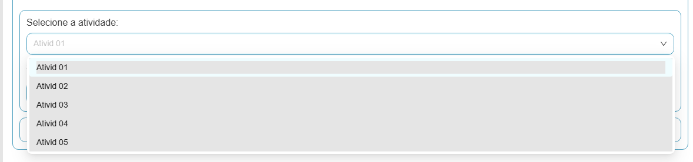

# BUG-010 — Dropdown de atividades: texto exibido como "Ativid" em vez de "Atividade"

## Tipo
UI / Texto 

## Severidade
Baixa

## Ambiente
- SO: Windows 10/11
- Microsoft Edge: Versão 143.0.3650.96 (64 bits)
- Google Chrome: Versão 143.0.7499.170 (64 bits)

## Passos para reproduzir
1. Acessar a aba "Funcionário(s)"
2. Acessar a tela "Adicionar Funcionário".
3. Ir até a seção "Quais EPIs o trabalhador usa na atividade?".
4. Abrir o dropdown "Selecione a atividade:".

## Resultado atual (Aplicação)
- As opções do dropdown aparecem como "Ativid 01", "Ativid 02", "Ativid 03","Ativid 04","Ativid 05", com o texto truncado/incompleto.

## Resultado esperado (Protótipo)
- As opções devem aparecer como "Atividade 01", "Atividade 02", "Atividade 03", "Atividade 04", "Atividade 05", mantendo a sequência numérica.

## Evidências

## Sugestão de correção
- Corrigir o texto exibido no dropdown para "Atividade" e manter a numeração (01, 02, 03...).
