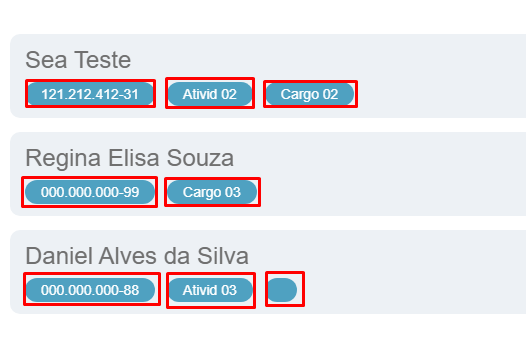

# BUG-013 — Lista de funcionários: badges do card não seguem padrão do protótipo (CPF, Cargo e Status)

## Tipo
UI / Regra de exibição de dados

## Severidade
Média 

## Ambiente
- SO: Windows 10/11
- Microsoft Edge: Versão 143.0.3650.96 (64 bits)
- Google Chrome: Versão 143.0.7499.170 (64 bits)

## Passos para reproduzir
1. Acessar a aba "Funcionário(s)".
2. Observar os cards/lista de funcionários exibidos.

## Resultado atual (Aplicação)
- Os cards exibem badges de forma inconsistente:
  - alguns funcionários não exibem as 3 informações;
  - em alguns casos há texto incorreto/truncado (ex.: "Ativid");
  - pode aparecer elemento diferente do padrão no lugar de um badge.
- Isso quebra a padronização e dificulta a leitura rápida.

## Resultado esperado (Protótipo)
- Cada funcionário deve exibir sempre 3 badges, conforme protótipo, nesta ordem:
  1. CPF
  2. Status (Ativo ou Inativo)
  3. Cargo

## Evidências

**Aplicação (Atual):**  

**Protótipo (Esperado):**  

## Sugestão de correção
- Padronizar o componente de badges do card para sempre renderizar CPF, Cargo e Status (Ativo/Inativo).
- Corrigir labels truncadas (ex.: "Ativid" -> "Atividade", se aplicável).
- Garantir consistência visual e de ordem entre todos os funcionários.
