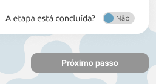
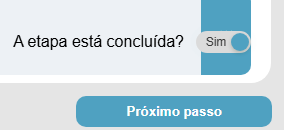

# BUG-002 — Botão "Próximo passo" não segue o protótipo nos estados Sim/Não (habilitado vs desabilitado)

## Tipo
Funcionalidade / Regras de UI

## Severidade
Alta

## Ambiente
- SO: Windows 10/11
- Microsoft Edge: Versão 143.0.3650.96 (64 bits)
- Google Chrome: Versão 143.0.7499.170 (64 bits)

## Passos para reproduzir
1. Acessar a tela da etapa.
2. Alternar "A etapa está concluída?" entre "Sim" e "Não".
3. Observar o estado do botão "Próximo passo" e tentar clicar em ambos os estados.

## Resultado atual (Aplicação)
- Com ***Não***: o botão permanece com aparência de habilitado (azul) e não fica desabilitado, porém não avança ao clicar.
- Com ***Sim***: o botão também permanece com aparência de habilitado (azul), porém não avança ao clicar.

## Resultado esperado (Protótipo)
- Com ***Não***: botão deve ficar **cinza (desabilitado)** e **não permitir clique**.
- Com ***Sim***: botão deve ficar **habilitado (azul)** e **permitir avançar**.

## Impacto
- Bloqueia o avanço do usuário no fluxo, pois o botão não navega em nenhum estado.
- Gera confusão de usabilidade: o botão aparenta estar habilitado (azul) mesmo quando deveria estar desabilitado (cinza).
- Afeta a validação do processo por etapas, já que a transição para o próximo passo não ocorre.

## Evidências

### Vídeo
- [Execução na aplicação (etapa_concluida_aplicacao.mp4)](etapa_concluida_aplicacao.mp4)

### Imagens — Protótipo

### Imagens — Aplicação

## Observações
- O botão não executa a navegação em nenhum dos estados (Sim/Não).
- Além disso, no estado Não, ele deveria estar visualmente desabilitado (cinza), conforme o protótipo.

## Sugestão de correção
- Desabilitar visualmente o botão no estado ‘Não’ e habilitar/navegar apenas no estado ‘Sim’ conforme protótipo.
