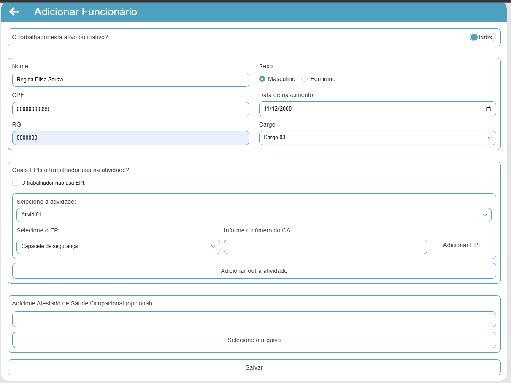
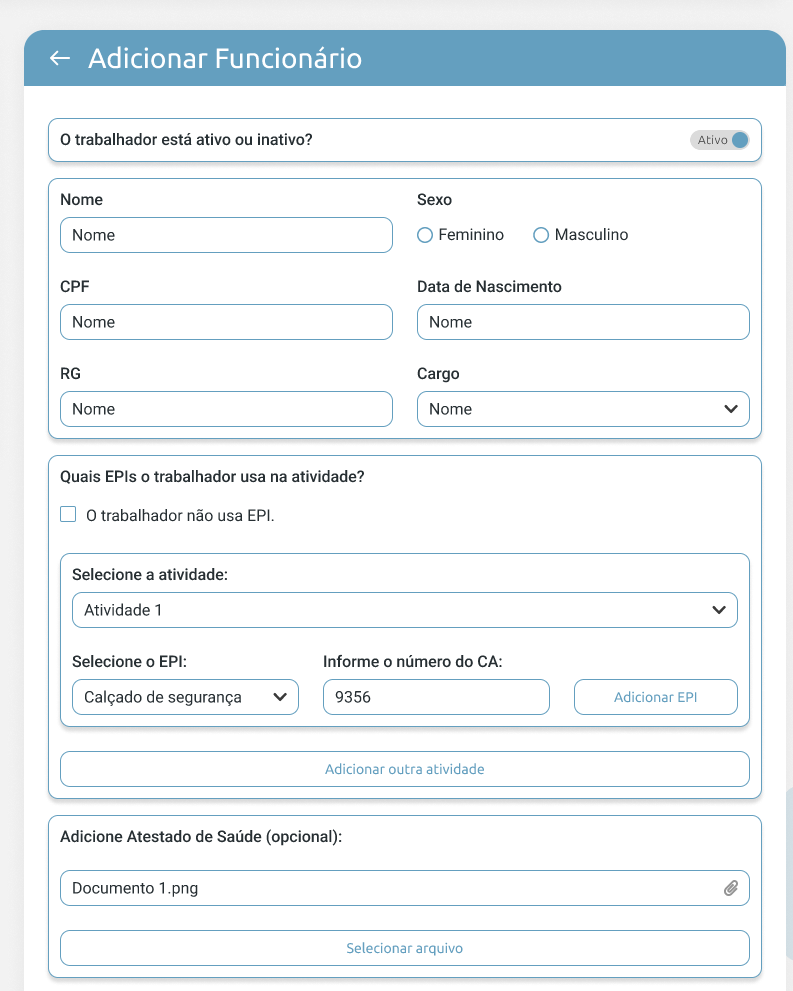

# BUG-009 — Formulário "Adicionar Funcionário": botão "Adicionar EPI" (layout e funcionalidade) não segue o protótipo

## Tipo
Funcionalidade + UI / Conformidade com Protótipo

## Severidade
Alta

## Ambiente
- SO: Windows 10/11
- Microsoft Edge: Versão 143.0.3650.96 (64 bits)
- Google Chrome: Versão 143.0.7499.170 (64 bits)

## Passos para reproduzir
1. Acessar a aba "Funcionário(s)"
2. Acessar a tela "Adicionar Funcionário".
3. Ir até a seção "Quais EPIs o trabalhador usa na atividade?".
4. Selecionar uma Atividade.
5. Selecionar um EPI e preencher o número do CA.
6. Clicar no botão "Adicionar EPI".

## Resultado atual (Aplicação)
- O botão "Adicionar EPI" não segue o layout do protótipo (posicionamento/estilo divergentes).
- Ao clicar em "Adicionar EPI", a funcionalidade não executa corretamente, ele apenas adiciona o funcionario e não deixa colocar uma nova EPI.

## Resultado esperado (Protótipo)
- O botão "Adicionar EPI" deve seguir o layout do protótipo (estilo/posição).
- Ao clicar em "Adicionar EPI", o sistema deve:
  - adicionar o EPI informado à lista da atividade;
  - permitir múltiplos EPIs (ex.: criar uma nova linha/bloco de EPI + CA);
  - atualizar os botões conforme o protótipo (ex.: EPI já adicionado com opção "Excluir EPI" e nova linha com "Adicionar EPI").

## Evidências
**Aplicação (Atual):**  

**Protótipo (Tela):**  

**Protótipo (Comportamento esperado ao adicionar múltiplos EPIs):**  

### Vídeo (Aplicação)
- [Fluxo no formulário e tentativa de adicionar EPI (adicionar_epi_aplicacao.mp4)](adicionar_epi_aplicacao.mp4)

## Dependência / Relacionado
- Relacionado ao **BUG-001** (padronização de fonte Segoe UI e cor #649FBF).

## Sugestão de correção
- Ajustar o layout do botão "Adicionar EPI" para corresponder ao protótipo.
- Implementar/corrigir o fluxo de inclusão de EPI:
  - validar campos (EPI e CA) antes de adicionar;
  - inserir novo item na lista e renderizar nova linha;
  - permitir exclusão do EPI adicionado conforme protótipo.
