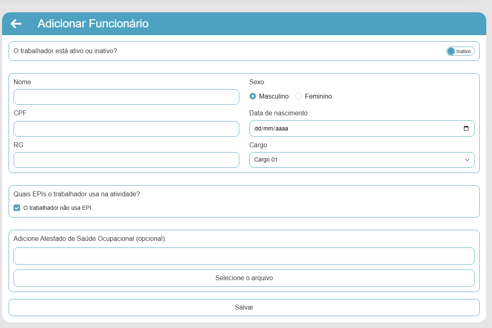

# BUG-011 — Formulário: ao marcar "O trabalhador não usa EPI", bloco de Atestado deve ocultar (e checkbox diverge do protótipo)

## Tipo
Funcionalidade / Regra de UI + Conformidade com Protótipo 

## Severidade
Média 

## Ambiente
- SO: Windows 10/11
- Microsoft Edge: Versão 143.0.3650.96 (64 bits)
- Google Chrome: Versão 143.0.7499.170 (64 bits)

## Passos para reproduzir
1. Acessar a aba "Funcionário(s)".
2. Clicar em "+ Adicionar Funcionário".
3. Ir até a seção "Quais EPIs o trabalhador usa na atividade?".
4. Marcar a opção "O trabalhador não usa EPI."
5. Observar os campos exibidos abaixo e o layout da caixa de seleção.

## Resultado atual (Aplicação)
- Mesmo com a opção "O trabalhador não usa EPI" marcada, o bloco "Adicione Atestado de Saúde Ocupacional (opcional)" (upload de arquivo) permanece visível.
- O layout da caixa de seleção (checkbox) diverge do protótipo.

## Resultado esperado (Protótipo)
- Ao marcar "O trabalhador não usa EPI", o bloco "Adicione Atestado de Saúde Ocupacional (opcional)" deve sumir (ou ficar desabilitado), conforme protótipo.
- A caixa de seleção deve seguir o mesmo layout/estilo apresentado no protótipo.

## Evidências
**Aplicação (Atual):**  

**Protótipo (Esperado):**  

## Sugestão de correção
- Implementar lógica condicional: quando "não usa EPI" estiver marcado, ocultar (ou desabilitar) o componente de upload do atestado.
- Padronizar o componente de checkbox para corresponder ao protótipo.
