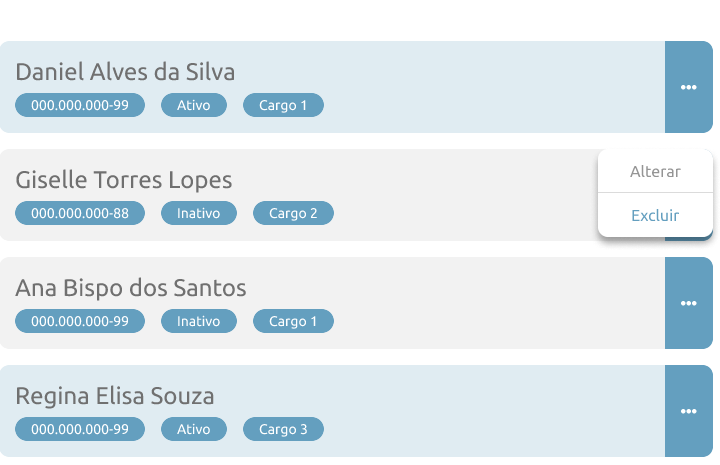

# BUG-012 — Lista de funcionários: menu de 3 pontos (...) deve exibir "Alterar" e "Excluir" conforme protótipo

## Tipo
CRUD / Funcionalidade + UI 

## Severidade
Alta 

## Ambiente
- SO: Windows 10/11
- Microsoft Edge: Versão 143.0.3650.96 (64 bits)
- Google Chrome: Versão 143.0.7499.170 (64 bits)

## Passos para reproduzir
1. Acessar a aba "Funcionário(s)".
2. Localizar qualquer funcionário na lista.
3. Clicar no ícone de 3 pontos (...), ou ellipsis, no card do funcionário.

## Resultado atual (Aplicação)
- O menu de opções não segue o protótipo (ex.: não exibe as opções/fluxo esperado).
- As ações "Alterar" e "Excluir" não ficam disponíveis conforme o padrão do protótipo.

## Resultado esperado (Protótipo)
- Ao clicar nos 3 pontos (...), ou ellipsis, do card de um funcionário, deve abrir um menu com duas opções:
  - Alterar
  - Excluir

## Evidências

**Aplicação (Atual):**  

**Protótipo (Esperado):**  

### Vídeo (Aplicação)
- [Interação no menu do funcionário (botao_alterar_e_excluir.mp4)](botao_alterar_e_excluir.mp4)

## Sugestão de correção
- Implementar/corrigir o menu de contexto do card (ellipsis) para exibir Alterar e Excluir.
- Garantir que as ações chamem os fluxos corretos (edição do registro e exclusão com atualização da lista).
